---

title: Panduan Penggunaan Dcloud
slug: panduan_dcloud
author: deva

---

<!-- truncate -->

Selamat datang di panduan penggunaan Cloud Storage! Layanan Cloud Storage ini merupakan layanan untuk menyimpan data berbasis cloud yang dimiliki Pemerintah Kota Denpasar.
Cloud Storage hadir sebagai solusi praktis untuk menyimpan, mengelola, dan membagikan data Anda secara efisien. Dalam panduan ini, kami akan memandu Anda melalui langkah-langkah penting untuk memanfaatkan Cloud Storage dengan maksimal, termasuk cara menyimpan data, mengamankan file, dan berbagi informasi secara cepat dan mudah.

Syarat Minimal Penggunaan
Untuk menggunakan layanan Cloud Storage, pengguna harus memenuhi beberapa persyaratan minimal berikut:

- Akses Internet Stabil
Cloud Storage membutuhkan koneksi internet yang stabil agar pengguna dapat mengunggah, mengunduh, dan mengakses data secara efisien.

- Perangkat yang Mendukung
Pengguna harus memiliki perangkat (seperti komputer, laptop, tablet, atau smartphone) yang mendukung akses web atau aplikasi Cloud Storage. 

- Sistem operasi minimal biasanya disesuaikan dengan ketentuan penyedia layanan.

- Akun Cloud Storage
Pengguna perlu mendaftar dan memiliki akun pada penyedia layanan Cloud Storage untuk mengakses dan mengelola data mereka. Jika belum memiliki silahkan untuk menghubungi Dinas Komunikasi, Informasi dan Statistik untuk mendapatkannya.

- Memori Perangkat Cukup
Untuk mengunduh dan menyimpan file dari Cloud Storage secara lokal, perangkat harus memiliki memori yang cukup.

- Pemahaman Dasar Teknologi
Pengguna disarankan memiliki pemahaman dasar tentang pengelolaan file dan folder untuk menggunakan Cloud Storage dengan lancar.

Petunjuk Menggunakan Dcloud

- Mengakses Sistem

    Halaman ini dapat diakses melalui web di url berikut: `https://cloud.denpasarkota.go.id. `Pengguna yang terdaftar memiliki hak akses yang akan dijelaskan pada sub bab selanjutnya. Untuk masuk ke dalam sistem memerlukan user dan password yang telah dibuat sebelumnya oleh DKIS (Dinas Komunikasi, Informasi dan Statistik) melalui proses permohonan. Untuk Perangkat Daerah yang sebelumnya belum memiliki akun admin, dapat bertanya terlebih dahulu ke staf atau bagian IT di instansinya apakah sebelumnya sudah memiliki akun admin pada layanan cloud storage. Jika belum, dapat melakukan permohonan akun baru terlebih dahulu.

- Pembagian Hak Akses

    Sub bab ini diperuntukkan oleh Admin yang ditunjuk sebagai  Pengguna yang terdaftar. Admin dalam memberikan akses ke user pada masing-masing bidang di instansi terkait wajib membuat folder untuk masing-masing bidang dan memberikan password pada setiap folder yang dibuat. 
    User hanya bisa melakukan upload, edit, delete files/folder, untuk keperluan sharing files/folder wajib melaporkan terlebih dahulu kepada Admin di masing-masing untuk dibuatkan link sharenya dan diatur lebih lanjut apakah menggunakan periode waktu/password dalam mengaksesnya.

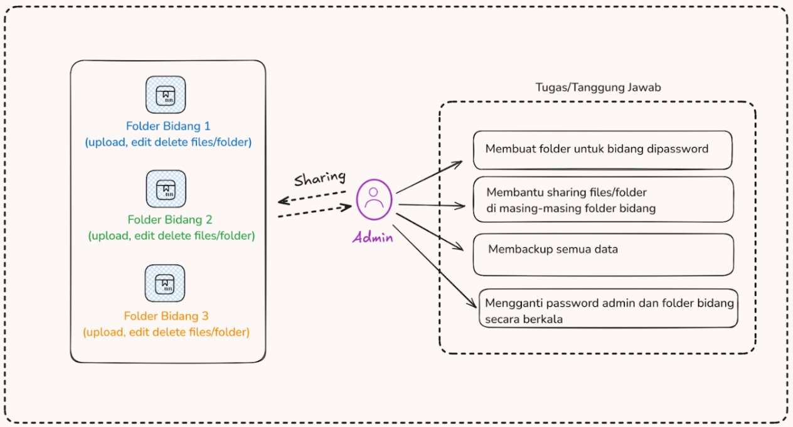

    Di atas merupakan bagan yang menjelaskan apa tugas dan tanggung jawab dari user admin.

- Login/masuk & Overview Aplikasi

    Setelah melakukan permohonan layanan cloud storage pada Dinas Komunikasi dan Informatika Pemerintah Kota Denpasar, user yang terdaftar dapat mengakses layanan pada domain `https://cloud.denpasarkota.go.id`, masukkan user dan password yang sudah diberikan.

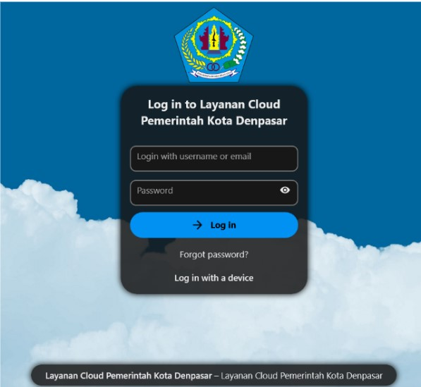

    Setelah melakukan login nanti akan tampil halaman pada gambar 2. Halaman ini merupakan beranda halaman user. Halaman ini terdiri top bar (menu atas) dan sidebar (menu samping). 

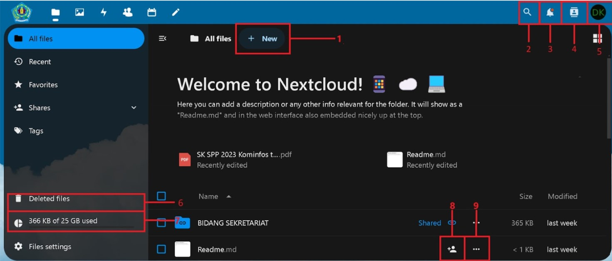

Berikut adalah informasi dari beberapa tombol pada gambar 2:
        - Tombol Upload: Untuk mengunggah file atau folder;
        - Pencarian: Untuk mencari file atau folder;
        - Notifikasi: Untuk menampilkan notifikasi pengguna;
        - Daftar kontak: Untuk menambahkan kontak dengan mencantumkan email;
        - User manager: Untuk mengubah pengaturan profil pengguna;
        - Tempat sampah: Berisi daftar berkas file dan folder yang telah di hapus;
        - Kapasitas penyimpanan: Untuk melihat
        kapasitas penggunaan storage;
        - Tombol share: Untuk membagikan link url file;
        - Tombol action: Berisi menu favorit, unduh, hapus, detail, ganti nama, pindah atau salin file.

Fitur Utama Aplikasi

- Membuat Folder untuk user
    Klik menu `+ New`  dan pilih `New Folder` terlebih dulu untuk membuat folder yang akan di-sharing ke masing-masing bidang pada instansi.

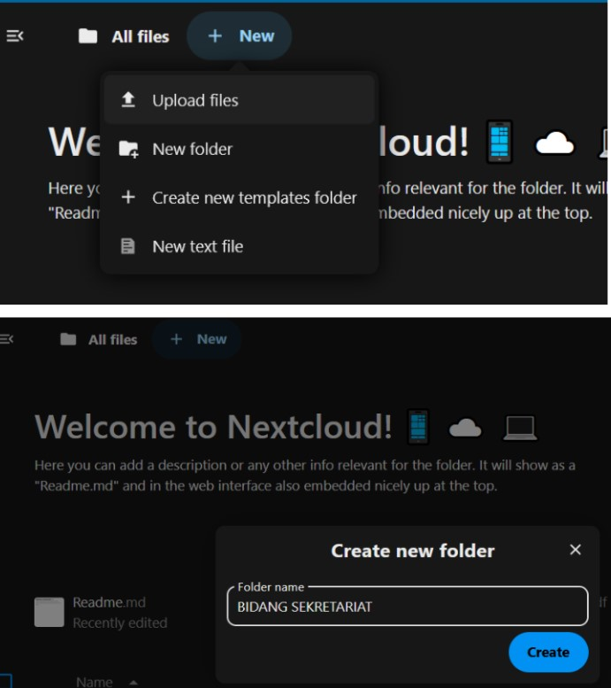

- Sharing folder untuk pengguna layanan
    Fitur ini digunakan untuk membagi akses supaya user dapat membuka isi dari sebuah folder

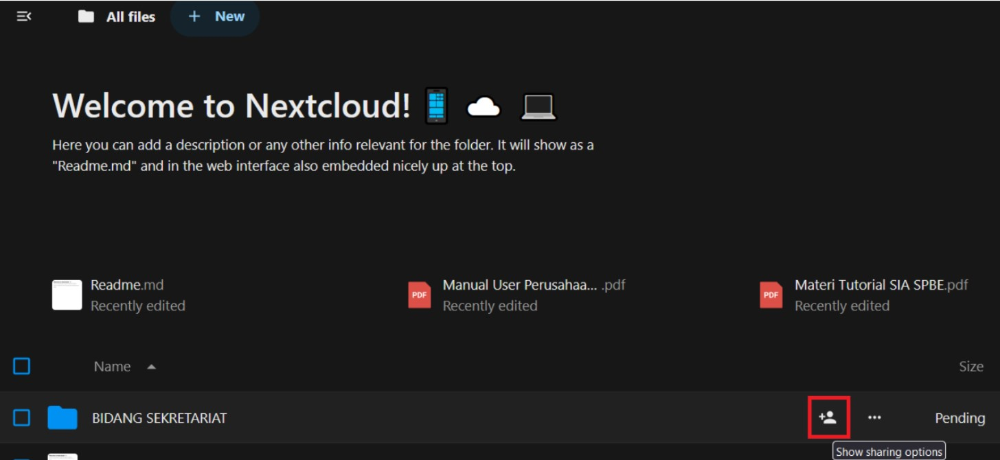

    Klik ikon `Manusia dan lambang + `akan muncul informasi folder yang di-sharing kemudian pilih `tanda +` untuk melakukan sharing folder.

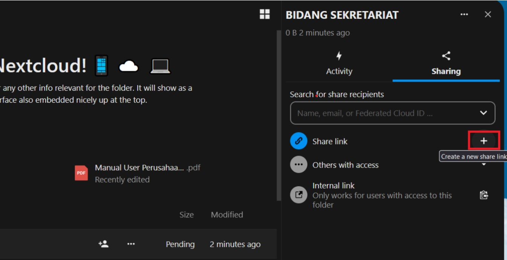

    Setelah folder berhasil di-share akan ada informasi `Share link “View only”`, klik menu tersebut dan pilih `Custom permission` seperti pada gambar dibawah ini.

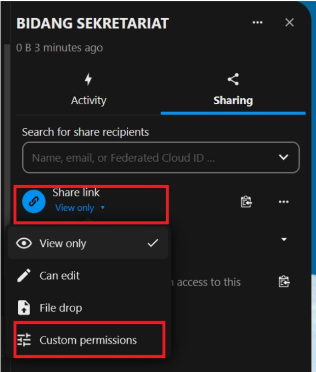

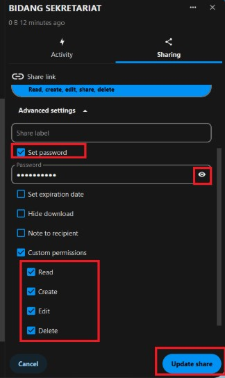

    Centang pada bagian `Set password` agar dibuatkan password secara acak oleh sistem kemudian copy passwordnya dengan cara klik icon `“”` lalu berikan centang juga pada bagian `Custom permission “Read”, “Create”, “Edit” dan “Delete”`, jika sudah klik `Update share` untuk menyimpan perubahan.

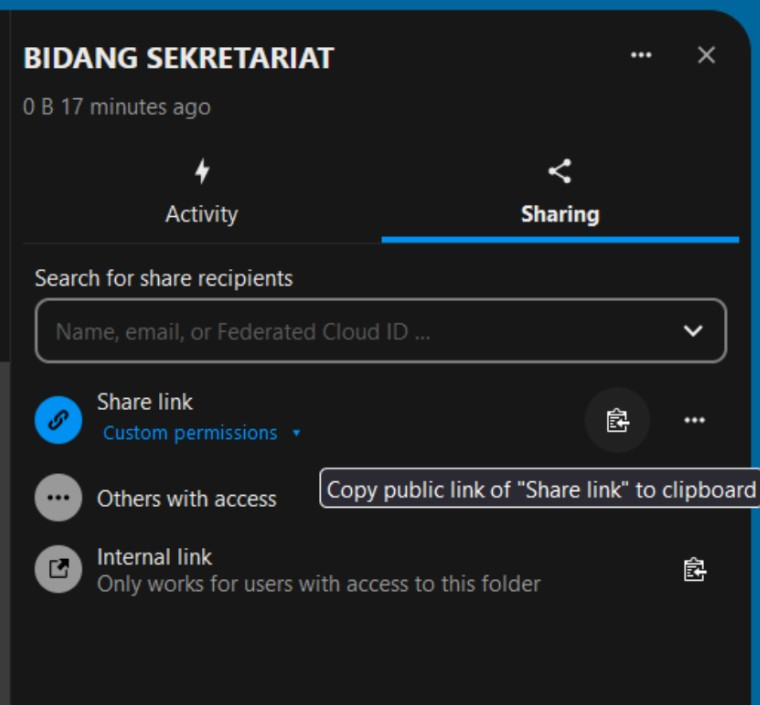

    klik `ikon Tugas` disamping icon titik tiga untuk menyalin link folder yang akan dishare. Kemudian coba akses link tersebut pada halaman tab browser baru.

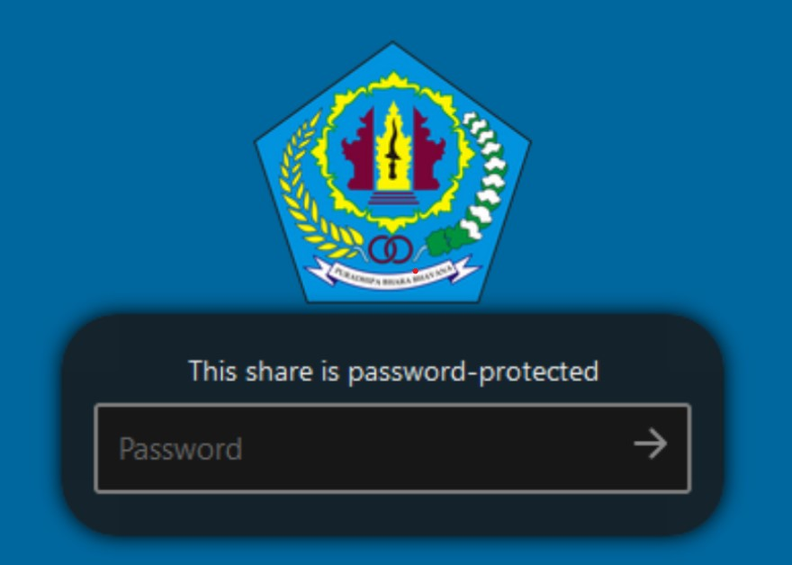

    Masukkan password folder yang sebelumnya telah dibuat, jika benar maka akan masuk ke foldernya seperti pada gambar dibawah ini. Pada folder ini pengguna dapat melakukan aktivitas upload dan lainnya.

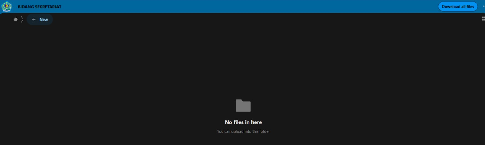

- Mengupload file/folder di sisi pengguna

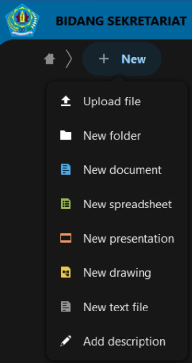

    Klik tombol `+ New` dan pilih menunya sesuai dengan keperluan misalkan untuk upload file bisa mengklik `Upload file` atau membuat folder baru kembali dapat di klik pilihan `New folder` seperti gambar di atas.

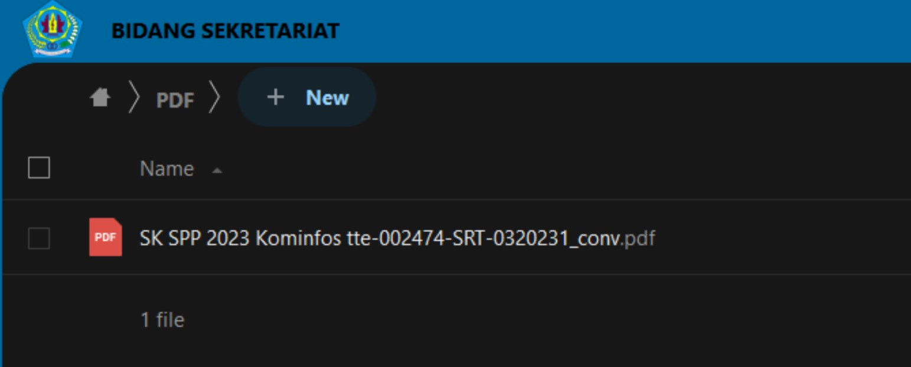

    Hasil file yang sudah terupload akan muncul pada masing-masing folder yang telah dibuat oleh admin.

- Share file yang sudah di upload oleh pengguna
Untuk melakukan share file, admin dari perangkat daerah yang bertanggung jawab atas file/folder yang akan di-share ke publik dengan cara menanyakan kepada user yang bersangkutan untuk file/folder user yang akan dilakukan sharing.
Seperti contoh di bawah bahwa user Bidang Sekretariat ingin meng-share file `SK SPP 2023 Kominfos tte-002474-SRT-0320231_conv.pdf` pada folder PDF maka pada halaman jendela dengan akses admin, carilah file tersebut dan klik ikon .

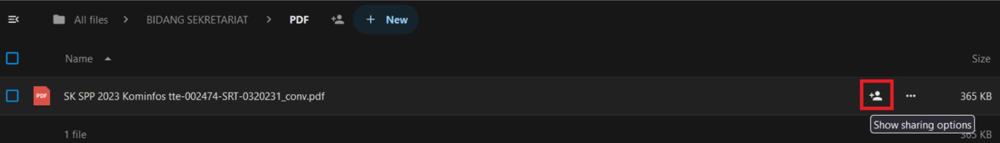

Dilanjutkan dengan mengklik tab Sharing, setelah itu pilih tombol plus +, seperti pada gambar di bawah. 

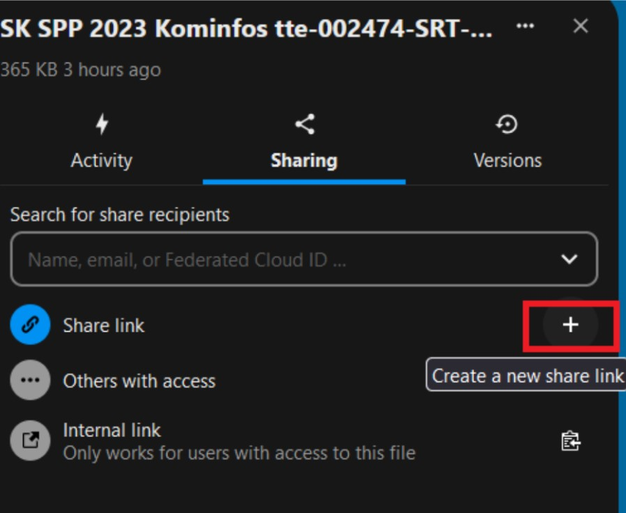
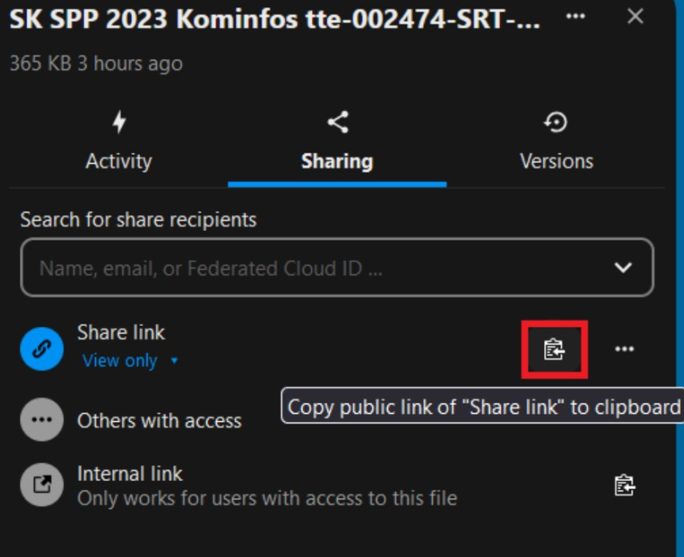

Copy link nya dan informasikan ke user yang bersangkutan agar dapat diakses secara publik file yang sudah di-share 

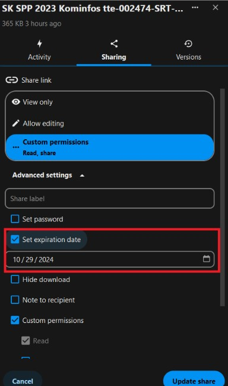

Atau dapat disesuaikan kembali kebutuhannya misalkan dengan mengisi tanggal kadaluarsa dari file yang akan di-sharing ataupun memberikan password saat file ini di akses dari publik seperti pada gambar di atas.

- Menu Profil User Admin
	Pada menu profil user terdapat menu Set status, Appearance and accessibility, Settings, About, Help, Log Out. pada menu set status user dapat merubah status mereka menjadi online, away, do not disturb, invisible. Pada Appearance and accessibility user bisa merubah tampilan dari homepage/background. Menu setting adalah tempat dimana user dapat melakukan perubahan terhadap profil pengguna seperti mengganti foto profil, username, bahasa, dll.
        - Aktifasi 2FA (Autentikasi Dua-Faktor)
        Fitur 2FA adalah fitur yang digunakan user untuk menambah layer keamanan pada akun. Untuk mengaktifkan fitur ini silahkan pergi ke halaman pengaturan akun. Caranya dengan mengklik ikon logo user pada pojok kanan atas lalu pilih tab security sehingga tampil seperti pada gambar di bawah ini.

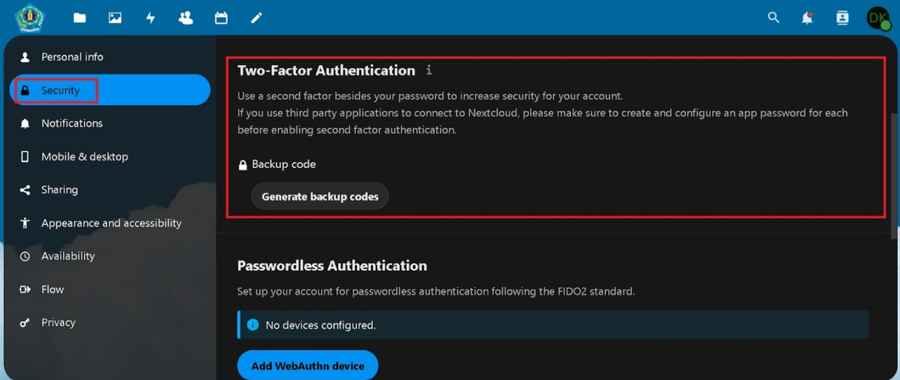

        - Logout
        Fitur logout adalah fitur yang digunakan pengguna untuk keluar dari aplikasi ini. Cara logout adalah dengan cara tekan tombol logout pada menu profil pengguna.

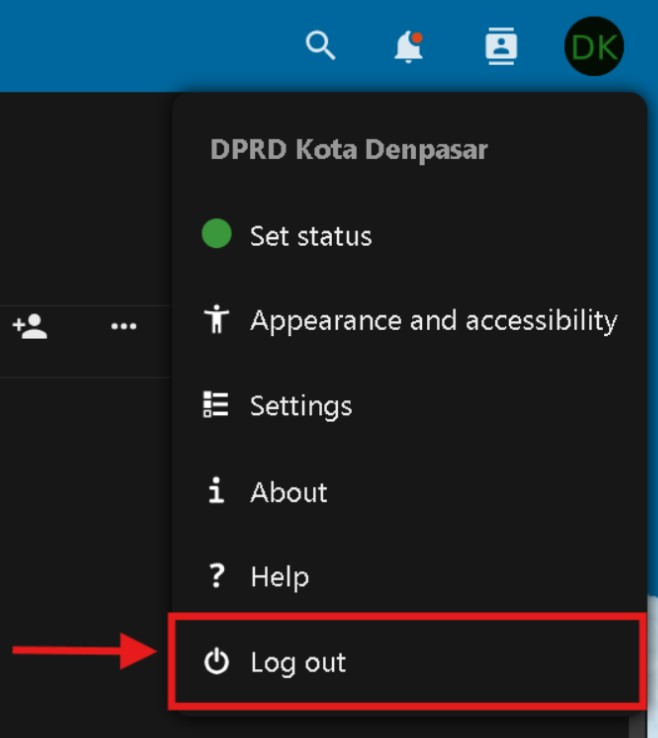
