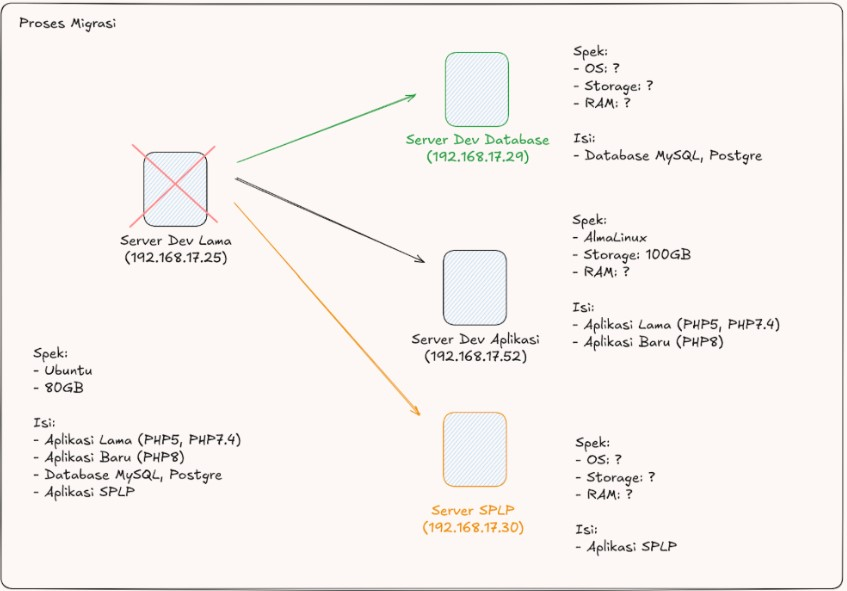

---

slug: panduan-migrasi-server
title: Panduan Migrasi Server
author: deva

---

<!-- truncate-->

Panduan ini menjelaskan mengenai kegiatan yang dilakukan oleh tim teknis. Tujuan dilakukannya kegiatan ini untuk memindahkan environment server pengembangan/development menggunakan server dengan versi yang lebih baru. Selain itu tujuan lainnya untuk melakukan penataan server development agar sesuai dengan fungsinya dan dapat digunakan secara efisien.

Jumlah server yang terlibat ada 3 server baru dan 1 server lama

Tools Yang digunakan Wireguard (VPN), Terminal, Command Prompt/Powershell,  PuTTY (Terminal, SSH).

Spesifikasi Server Baru 

    - 1 Server Aplikasi (192.168.17.52)
        CPU: 4 vCPU
        RAM: 4 GB
        OS: AlmaLinux 8
        Storage: 100 GB

    - 1 Server Database (192.168.17.29)
        CPU: 4 vCPU
        RAM: 4 GB
        OS: AlmaLinux 8
        Storage: 100 GB

    - 1 Server SPLP (192.168.17.30)
        CPU: 4 vCPU
        RAM: 4 GB
        OS: AlmaLinux 8
        Storage: 100 GB

Syarat Akses

- Akun Wire Guard (VPN)
Akses ini digunakan untuk mengakses jaringan internal. Jadi pelaksana wajib untuk memiliki akun ini selama kegiatan. Untuk Instalasi VPN ini nanti dapat dilakukan pada komputer masing-masing pelaksana, untuk konfigurasinya seperti pemberian Key nanti akan diberikan oleh Tim Infrastruktur.

- Akun SSH/SFTP
Akses ini digunakan untuk mengakses server/VM melalui terminal atau aplikasi pihak ketiga. Akses ini diperlukan untuk melakukan konfigurasi di server. Untuk akun ini nanti akan dibuatkan per server.

Konfigurasi yang akan dilakukan pada server
Server Aplikasi (192.168.17.52)

`checklist`
Update OS AlmaLinux


Kegiatan ini melibatkan 3 server baru yang akan dilakukan instalasi dan konfigurasi. Server Development yang lama akan dihapus dan isi di dalamnya yang terdiri dari Aplikasi lama, baru, database dan aplikasi SPLP (Sistem Penghubung Layanan Pemerintahan) akan dipindahkan ke masing-masing server baru yang nanti akan dilakukan konfigurasi terlebih dahulu sebelum memindahkan semua data tersebut. Untuk melihat lebih lanjut gambarannya dapat melihat bagan pada gambar 1.




Checklist Migrasi:
Untuk membantu proses migrasi, maka tim akan berpedoman dengan bagan step yang sudah dijelaskan sebelumnya. Step-stepnya dapat digambarkan dalam bagan pada gambar 2.

langkah pertama 

```js
localhost routes

```